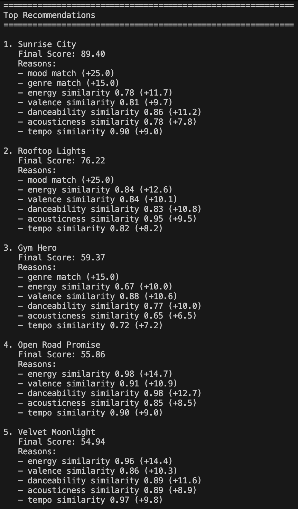
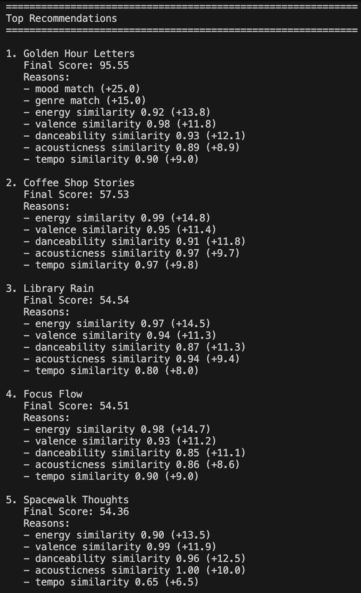
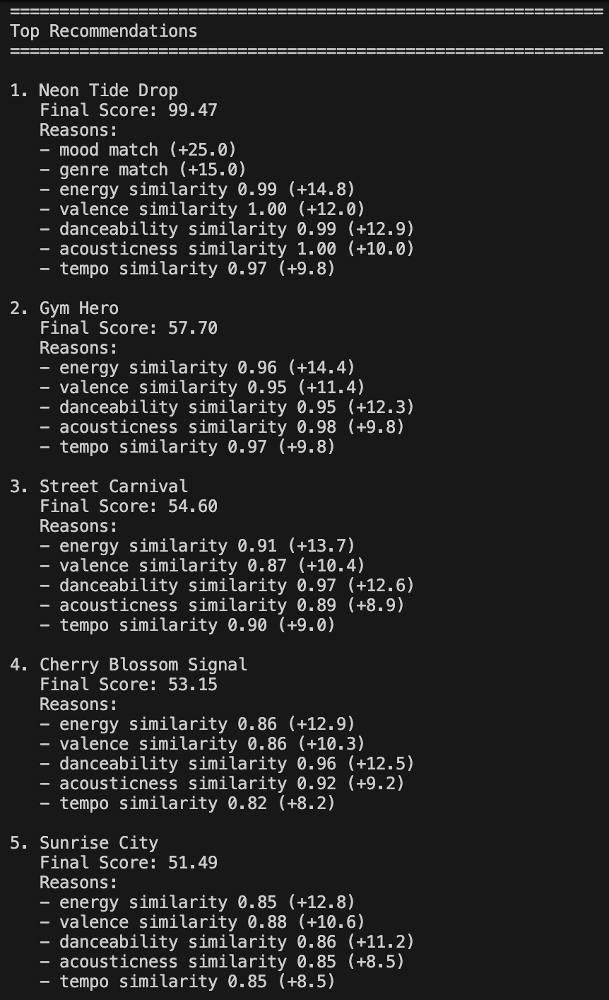
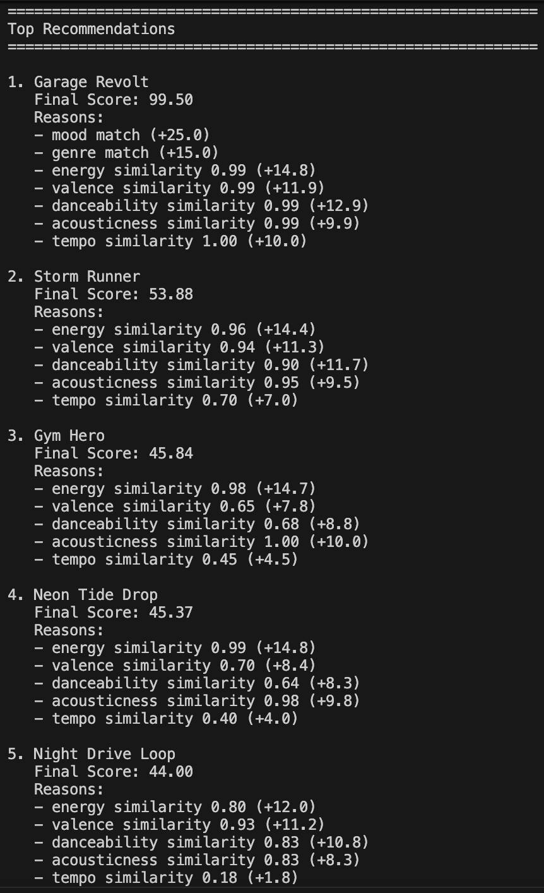

# 🎵 Music Recommender Simulation

## Project Summary

In this project you will build and explain a small music recommender system.

Your goal is to:

- Represent songs and a user "taste profile" as data
- Design a scoring rule that turns that data into recommendations
- Evaluate what your system gets right and wrong
- Reflect on how this mirrors real world AI recommenders

Replace this paragraph with your own summary of what your version does.

---

## How The System Works

Real-world systems capture a user's preferences and assigns each song a set of measurable features. They calculate a compatability score between the user and every song candidate, and ranks the scores to find the best matches. 

My simulation will mirror this structure by:
- assigning each song a set of categorical and numerical features (mood, energy, tempo, valence, danceability, acousticness)
- storing the user's preferred value for each of the feature types in their profile (favorite mood, favorite genre, target energy, etc.)
- when computing a song score, prioritizing 1) genre and mood match and 2) numerical proximity for energy

The finalized algorithm recipe works as follows:
1. The user gives preferences or liked songs
2. The program will build a user taste profile with their preferred mood and genre signals as well as numeric targets for energy, tempo, valence, danceability, and acousticness.
3. Each single song in songs.csv will be iterated through to read the song's features, compute a weighted similarity score, and then save the song and its total score.
4. All scored songs will be sorted from highest to lowest
5. Return top K recommendations as ranked list of recommendations

Scoring Logic: 
- Score = Mood(25) + Genre(15) + Energy(15) + Tempo(10) + Valence(12) + Danceability(13) + Acousticness(10)
- Mood and Genre get full points for an exact match, otherwise a zero.
- Energy, valence, danceability, and acousticness use this similarity formula -> 1 - |x_song - x_user|
- Feature points = feature weight * similarity
- Tempo uses this similarity formula -> 1 - min(|t_song - t_user|/80, 1)
- Tempo points = 10 * tempo similarity

Potential biases could occur due to the high weights placed on exact mood and genre matches. This could lead to over-favoring of frequently represented categories in the dataset and underrecommending of niche or cross-genre songs. Users may also be unable to explore new styles, moods and artists as much since it scores based on past preferences.

Screenshot 1: Default Profile Results - Favors upbeat, mainstream and mid-tempo tracks


Screenshot 2: Acoustic Focus Profile Results - Favors more mellow and acoustic tracks


Screenshot 3: Club Rush Profile Results - Favors more high-energy, danceable and low-acoustic tracks


Screenshot 4: Punk Spirit Profile Results - Favors very fast, intense and low-acoustic tracks


---

## Getting Started

### Setup

1. Create a virtual environment (optional but recommended):

   ```bash
   python -m venv .venv
   source .venv/bin/activate      # Mac or Linux
   .venv\Scripts\activate         # Windows

2. Install dependencies

```bash
pip install -r requirements.txt
```

3. Run the app:

```bash
python -m src.main
```

### Running Tests

Run the starter tests with:

```bash
pytest
```

You can add more tests in `tests/test_recommender.py`.

---

## Experiments You Tried

Use this section to document the experiments you ran. For example:

- What happened when you changed the weight on genre from 2.0 to 0.5
- What happened when you added tempo or valence to the score
- How did your system behave for different types of users

---

## Limitations and Risks

Summarize some limitations of your recommender.

Examples:

- It only works on a tiny catalog
- It does not understand lyrics or language
- It might over favor one genre or mood

You will go deeper on this in your model card.

---

## Reflection

Read and complete `model_card.md`:

[**Model Card**](model_card.md)

Write 1 to 2 paragraphs here about what you learned:

- about how recommenders turn data into predictions
- about where bias or unfairness could show up in systems like this


---

## 7. `model_card_template.md`

Combines reflection and model card framing from the Module 3 guidance. :contentReference[oaicite:2]{index=2}  

```markdown
# 🎧 Model Card - Music Recommender Simulation

## 1. Model Name

Give your recommender a name, for example:

> VibeFinder 1.0

---

## 2. Intended Use

- What is this system trying to do
- Who is it for

Example:

> This model suggests 3 to 5 songs from a small catalog based on a user's preferred genre, mood, and energy level. It is for classroom exploration only, not for real users.

---

## 3. How It Works (Short Explanation)

Describe your scoring logic in plain language.

- What features of each song does it consider
- What information about the user does it use
- How does it turn those into a number

Try to avoid code in this section, treat it like an explanation to a non programmer.

---

## 4. Data

Describe your dataset.

- How many songs are in `data/songs.csv`
- Did you add or remove any songs
- What kinds of genres or moods are represented
- Whose taste does this data mostly reflect

---

## 5. Strengths

Where does your recommender work well

You can think about:
- Situations where the top results "felt right"
- Particular user profiles it served well
- Simplicity or transparency benefits

---

## 6. Limitations and Bias

Where does your recommender struggle

Some prompts:
- Does it ignore some genres or moods
- Does it treat all users as if they have the same taste shape
- Is it biased toward high energy or one genre by default
- How could this be unfair if used in a real product

---

## 7. Evaluation

How did you check your system

Examples:
- You tried multiple user profiles and wrote down whether the results matched your expectations
- You compared your simulation to what a real app like Spotify or YouTube tends to recommend
- You wrote tests for your scoring logic

You do not need a numeric metric, but if you used one, explain what it measures.

---

## 8. Future Work

If you had more time, how would you improve this recommender

Examples:

- Add support for multiple users and "group vibe" recommendations
- Balance diversity of songs instead of always picking the closest match
- Use more features, like tempo ranges or lyric themes

---

## 9. Personal Reflection

A few sentences about what you learned:

- What surprised you about how your system behaved
- How did building this change how you think about real music recommenders
- Where do you think human judgment still matters, even if the model seems "smart"

